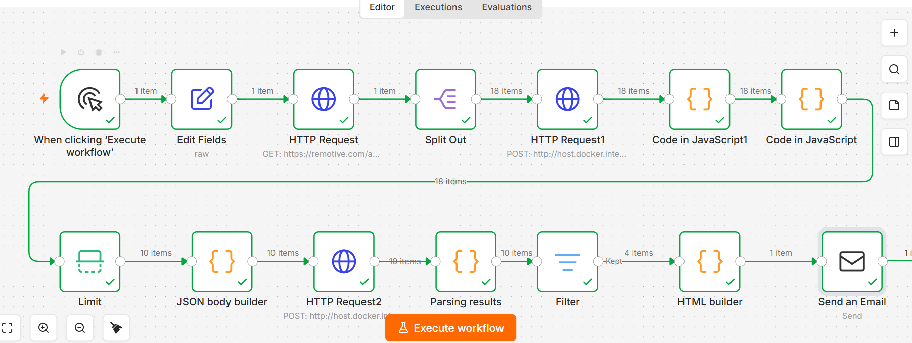

# AI Job Matcher

🇷🇺 [Русский](#русский) | 🇬🇧 [English](#english)

---

## Русский

Автономный n8n-воркфлоу, который ежедневно ищет вакансии, оценивает их соответствие резюме через двухэтапный AI-pipeline (эмбеддинги + LLM re-ranking) и присылает подборку лучших вариантов на email — с оценкой и объяснением по каждой вакансии.

### Зачем

Ручной мониторинг job-бордов занимает время и требует прочитать десятки нерелевантных объявлений ради пары подходящих. Этот проект автоматизирует первичный отбор: вместо списка вакансий вы получаете уже отранжированную подборку с объяснением, почему каждая вакансия подходит (или не подходит) под ваш профиль.

### Архитектура



```
Trigger (Schedule / Manual)
        │
        ▼
Edit Fields — резюме + его эмбеддинг (считается один раз)
        │
        ▼
HTTP Request → Remotive API (поиск вакансий)
        │
        ▼
Split Out — разбивает список вакансий на отдельные items
        │
        ▼
HTTP Request1 → Ollama /api/embeddings
(эмбеддинг каждой вакансии, локально, модель nomic-embed-text)
        │
        ▼
Code in JavaScript1 / Code in JavaScript — cosine similarity
(сравнение эмбеддинга каждой вакансии с эмбеддингом резюме,
сортировка по убыванию)
        │
        ▼
Limit — топ-10 по similarity
        │
        ▼
JSON body builder — сборка промпта для LLM
        │
        ▼
HTTP Request2 → Ollama /api/generate
(модель llama3.2, оценка 0–100 + объяснение на естественном языке)
        │
        ▼
Parsing results — парсинг JSON-ответа LLM, сортировка по итоговому score
        │
        ▼
Filter — порог по score
        │
        ▼
HTML builder — сборка HTML-письма
        │
        ▼
Send an Email (SMTP)
```

### Почему двухступенчатый pipeline, а не просто LLM на все вакансии

- **Эмбеддинги** — быстрый и дешёвый способ отсеять явно нерелевантные вакансии из широкого пула (десятки штук в день)
- **LLM re-ranking** — применяется только к уже отфильтрованному топу, где нужна более тонкая оценка (учёт требуемого опыта, стека технологий, уровня позиции), которую чистый косинусный поиск не всегда улавливает

Это стандартный retrieval-паттерн, лежащий в основе RAG-систем, применённый здесь к задаче подбора вакансий.

### Стек

| Компонент | Технология |
|---|---|
| Оркестрация | n8n (self-hosted, Docker) |
| Источник вакансий | Remotive API |
| Эмбеддинги | Ollama, модель `nomic-embed-text` (локально) |
| LLM-оценка | Ollama, модель `llama3.2` (локально) |
| Логика | JavaScript (n8n Code nodes) |
| Доставка результата | Email (SMTP) |

Весь AI-стек работает **полностью локально** через Ollama — без внешних API, без лимитов запросов и без затрат на токены.

### Инженерные решения и ограничения (осознанные компромиссы)

- **Локальные модели вместо облачных API.** Решение принято ради независимости от rate-лимитов и стоимости — в процессе разработки бесплатные модели на внешних провайдерах (OpenRouter) периодически становились недоступны или упирались в лимит 20 запросов/минуту. Ollama снимает эту проблему полностью, ценой более скромного качества генерации по сравнению с крупными облачными моделями.
- **Обрезка описаний вакансий до ~800 символов** перед отправкой в LLM — необходимо, чтобы не превышать длину контекста локальной модели эмбеддингов.
- **Очистка HTML из описаний вакансий** — источник данных (Remotive) отдаёт описания в HTML-разметке, которая мешает и эмбеддингам, и LLM-промпту.
- **Устойчивый парсинг JSON-ответа LLM** — модель не всегда возвращает чистый JSON без пояснений, поэтому парсинг ответа сделан с fallback через regex-извлечение JSON-блока из текста.
- **Смена источника вакансий в процессе разработки** — изначально использовался Adzuna API, но он возвращал большое количество нерелевантных/спам-вакансий и не всегда отдавал поле `title`. Remotive оказался чище для IT-специализации и проще в структуре ответа.

### Установка и запуск

1. Поднимите n8n и Ollama через Docker:
   ```bash
   docker run -d --name n8n -p 5678:5678 -v n8n_data:/home/node/.n8n n8nio/n8n
   docker run -d --name ollama -p 11434:11434 -v ollama_data:/root/.ollama ollama/ollama
   ```
2. Скачайте модели:
   ```bash
   docker exec -it ollama ollama pull nomic-embed-text
   docker exec -it ollama ollama pull llama3.2
   ```
3. Импортируйте `workflow.json` в n8n (Workflows → Import from File)
4. Настройте SMTP-credential для узла Send an Email
5. Вставьте текст резюме в узел Edit Fields
6. Активируйте Trigger

### Возможные развития проекта

- Подключение нескольких источников вакансий одновременно (нормализация разноформатных API)
- Хранение истории уже показанных вакансий (чтобы не дублировать в повторных рассылках)
- Дообучение/тюнинг промпта LLM-оценки на размеченном наборе примеров для повышения точности

---

## English

An autonomous n8n workflow that searches for job postings daily, scores their fit against a resume through a two-stage AI pipeline (embeddings + LLM re-ranking), and emails a curated shortlist — with a score and an explanation for every job.

### Why

Manually scanning job boards takes time and means reading dozens of irrelevant postings for the sake of a handful of good ones. This project automates the first pass: instead of a raw list, you get an already-ranked shortlist with an explanation of why each job is (or isn't) a fit for your profile.

### Architecture


```
Trigger (Schedule / Manual)
        │
        ▼
Edit Fields — resume text + its embedding (computed once)
        │
        ▼
HTTP Request → Remotive API (job search)
        │
        ▼
Split Out — splits the job list into individual items
        │
        ▼
HTTP Request1 → Ollama /api/embeddings
(embedding for each job, local, nomic-embed-text model)
        │
        ▼
Code in JavaScript1 / Code in JavaScript — cosine similarity
(compares each job's embedding to the resume's embedding,
sorts descending)
        │
        ▼
Limit — top 10 by similarity
        │
        ▼
JSON body builder — builds the LLM prompt
        │
        ▼
HTTP Request2 → Ollama /api/generate
(llama3.2 model, 0–100 score + natural-language explanation)
        │
        ▼
Parsing results — parses the LLM's JSON response, sorts by final score
        │
        ▼
Filter — score threshold
        │
        ▼
HTML builder — builds the HTML email
        │
        ▼
Send an Email (SMTP)
```

### Why a two-stage pipeline instead of running an LLM over every job

- **Embeddings** — a fast, cheap way to filter out clearly irrelevant jobs from a wide daily pool
- **LLM re-ranking** — applied only to the already-filtered top candidates, where a finer-grained judgment is needed (required experience, tech stack, seniority level) that plain cosine similarity doesn't always capture

This is the standard retrieval pattern underlying RAG systems, applied here to job matching.

### Stack

| Component | Technology |
|---|---|
| Orchestration | n8n (self-hosted, Docker) |
| Job source | Remotive API |
| Embeddings | Ollama, `nomic-embed-text` model (local) |
| LLM scoring | Ollama, `llama3.2` model (local) |
| Logic | JavaScript (n8n Code nodes) |
| Delivery | Email (SMTP) |

The entire AI stack runs **fully locally** via Ollama — no external APIs, no rate limits, no token costs.

### Engineering decisions and trade-offs

- **Local models instead of cloud APIs.** Chosen for independence from rate limits and cost — during development, free models on external providers (OpenRouter) repeatedly became unavailable or hit the 20-requests-per-minute limit. Ollama removes this problem entirely, at the cost of somewhat lower generation quality compared to large cloud models.
- **Job description truncation to ~800 characters** before sending to the LLM — necessary to stay under the local embedding model's context length.
- **HTML stripping from job descriptions** — the data source (Remotive) returns descriptions as HTML markup, which interferes with both embeddings and the LLM prompt.
- **Resilient parsing of the LLM's JSON response** — the model doesn't always return clean JSON without extra commentary, so parsing includes a regex-based fallback to extract the JSON block from the text.
- **Switched job source mid-development** — the project initially used the Adzuna API, but it returned a large share of irrelevant/spam listings and didn't always include a `title` field. Remotive proved cleaner for IT roles and simpler in response structure.

### Setup

1. Spin up n8n and Ollama via Docker:
   ```bash
   docker run -d --name n8n -p 5678:5678 -v n8n_data:/home/node/.n8n n8nio/n8n
   docker run -d --name ollama -p 11434:11434 -v ollama_data:/root/.ollama ollama/ollama
   ```
2. Pull the models:
   ```bash
   docker exec -it ollama ollama pull nomic-embed-text
   docker exec -it ollama ollama pull llama3.2
   ```
3. Import `workflow.json` into n8n (Workflows → Import from File)
4. Configure an SMTP credential for the Send an Email node
5. Paste your resume text into the Edit Fields node
6. Activate the Trigger

### Possible extensions

- Connecting multiple job sources at once (normalizing differently-shaped API responses)
- Storing a history of already-shown jobs (to avoid duplicates across runs)
- Fine-tuning the LLM scoring prompt on a labeled example set to improve accuracy
